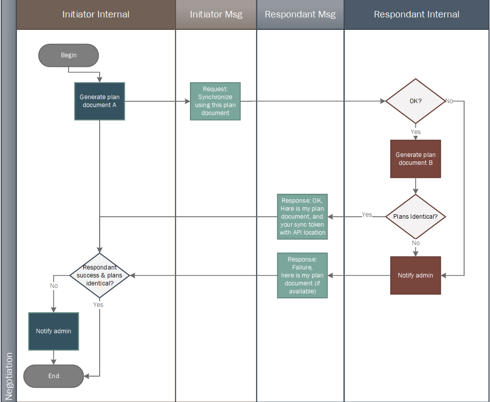

# The Sandpiper Framework Reference Documentation

- [Introduction](#introduction)
  - [About Sandpiper](#about-sandpiper)
  - [Background](#background)
  - [Basic Terms](#basic-terms)
- [Data & Object Models](#data--object-models)
  - [Products & Product Data](#products--product-data)
    - [Products](#products)
    - [Product Data](#product-data)
  - [Data Synchronization](#data-synchronization)
    - [Full Replacements](#full-replacements)
    - [Partial Changes](#partial-changes)
  - [Object Model](#object-model)
    - [Persistent Objects](#persistent-objects)
    - [Reference Objects](#reference-objects)
  - [Granulation](#granulation)
- [Interaction Model](#interaction-model)
  - [Interaction Objects and UUIDs](#interaction-objects-and-uuids)
  - [Actors](#actors)
  - [The Plan](#the-plan)
    - [Plan Domains](#plan-domains)
  - [The Connection](#the-connection)
    - [The Introduction](#the-introduction)
    - [The Exchange](#the-exchange)
      - [The Plan Proposal Workflow](#the-plan-proposal-workflow)
      - [Transaction](#transaction)
      - [Confirmation](#confirmation)
  - [Levels](#levels)
    - [Level 0](#level-0)
    - [Level 1](#level-1)
    - [Level 2](#level-2)
    - [Level 3](#level-3)
- [The Sandpiper API and Protocol](#the-sandpiper-api-and-protocol)
  - [The Sandpiper Message](#the-sandpiper-message)
  - [Level 1 and 2 API](#level-1-and-2-api)
    - [Authentication and Negotiation](#authentication-and-negotiation)
  - [Level 3 API and Protocol](#level-3-api-and-protocol)
- [Implementation Examples](#implementation-examples)
  - [Input / Output](#input-output)
    - [Input Workflow](#input-workflow)
      - [Classic PIM Input](#classic-pim-input)
      - [Sandpiper-Aware PIM Input](#sandpiper-aware-pim-input)
      - [Sandpiper-Capable PIM Input](#sandpiper-capable-pim-input)
    - [Output Workflow](#output-workflow)
      - [Classic PIM Output](#classic-pim-output)
      - [Sandpiper-Aware PIM Output](#sandpiper-aware-pim-output)
      - [Sandpiper-Capable PIM Output](#sandpiper-capable-pim-output)
  - [Interaction Scenarios](#interaction-scenarios)
    - [Data Brokers](#data-brokers)
  - [Tips and Best Practices](#tips-and-best-practices)
    - [UUIDs](#uuids)
    - [Data Integrations](#data-integrations)
- [Appendix A: Reference Values](#appendix-a-reference-values)
  - [Slice Type](#slice-type)
  - [Link Fields](#link-fields)
  - [Plan Status](#plan-status)
  - [Message Codes](#message-codes)
- [Appendix B: Granulation Strategies](#appendix-b-granulation-strategies)
  - [Files](#granulation-strategies-for-files)
  - [ACES](#granulation-strategies-for-aces)
- [Glossary](#glossary)
- [Copyright Notice](#copyright-notice)
- [Licensing](#licensing)

## Introduction

### About Sandpiper

Sandpiper establishes a common, decentralized method to classify, distribute, and synchronize product data between a canonical sender and a derivative receiver. To do this it defines, as unambiguously as possible, both a model for interaction and shared vocabulary to describe the many moving pieces involved.

Sandpiper tries to do this one thing well, and does not attempt to branch into other realms better handled by dedicated tools.

### Background

This is the reference documentation for the Sandpiper Framework, a cross-platform, open-source product data synchronization initiative. Increasingly, product data resides in more systems, is more difficult to update, is less verifiable, and requires increasingly variable and proprietary methods to deliver.

The founding members of the team come from the automotive aftermarket industry, where the broad range of products sold (from consumer electronics to pistons and everything between) combine with stringent certifications of fitment and detail to create massive catalogs of data that must be updated regularly. A medium-sized aftermarket supplier will have tens of thousands of SKUs, hundreds of thousands of pictures, and millions of rows of fitment data to communicate to dozens of receivers monthly. To complicate matters further, no unambiguous standard for partial data delivery exists, meaning all of this data has to be sent in full to propagate even a single change.

Yet while this project began in the automotive world, the problem is one that extends to all product data, regardless of industry; though various industry- and partner-specific standards and formats exist to describe products, there's no standard way to actually *send* them, to change just one piece of one product's data, or to make sure that what *was* sent actually covers what was requested. This applies as much to T-shirts as it does to spark plugs.

We believe the Sandpiper framework can make this process a little less painful for everyone who has to get information about their products into the world.

### Basic Terms

Before we go further, there are a few basic terms to introduce, since they're used so often. For more detailed explanations, you can refer to the later parts of the document.

In Sandpiper, individuals or individual systems involved in exchanging and hosting data are known as *Nodes*. When they interact, these nodes are known as *Actors*.

Actors exchange data about *Products*. Products (or SKUs, units, items, parts, and so on) are usually goods -- though they can also be services. Sandpiper specializes in the core data that defines these products, which we call *Product Data*: information that, were it to change, would also mean the product or its use itself had changed.

The framework does not make special accommodations for other kinds of data, which we call *Non-Product Data*, even when it is product adjacent.

## Data & Object Models

### Products & Product Data

#### Products

Products are controlled by a *Creator*, the manufacturer or provider with ultimate authority over its form and availability. A product has a single *Part Number* that is unique among all its creator's products^[In the real world, part numbers can and do overlap between manufacturers. However, only in the case of poorly controlled and structured business data does this happen within the *same* manufacturer. In Sandpiper, the singular part number per creator is a pivotal point and thus required.].

#### Product Data

Sandpiper's focus is product data, which has two primary characteristics:

1. It defines the product, such that changing existing product data (except as a correction or addition) usually means a material change to the product itself
1. It is nearly stateless, in that it changes infrequently, is not time-sensitive, and is not context-sensitive

To give an example of the first primary characteristic of product data, if a sprocket has five teeth when first communicated, that could not be changed to six teeth in a second communication without raising an eyebrow; if the part truly changed from five to six teeth, it's been fundamentally altered and will not function the same way. It really is a new product, even if it supersedes the old for some reason. While Sandpiper doesn't prohibit any changes, making functional modifications like this without introducing a new number is at best ill-advised.

To illustrate the second primary characteristic of product data, if the same sprocket is communicated at the same time to Customer A and Customer B, they will both see the same number of teeth. Product data is the same at any given point in time for any customer or relationship^[Some exception may be made for varying "flavors" of things like market copy, usage notes, and so on, but this creates an element of uncertainty that probably discounts these elements from use as anchor points within Sandpiper].

Some examples of product data:

- Fitment information
- Physical characteristics like weight, dimensions, etc.
- Pictures of the product that convey its characteristics
- Product contents list
- Permanent marketing copy (i.e. not campaign copy and the like)
- Universal retail price

##### Non-Product Data

Sandpiper doesn't forbid the transmission of other types of data (particularly since there's so much grey area), but doesn't make any provisions for it.

In contrast to product data, other kinds of data tend to change quickly, or are only valid within a given time or context; they are stateful and reference rather than define products. This includes the data that records and enables purchasing between entities as well as that which describes the current status of products within a supply chain.

Some examples of non-product data:

- Per-customer pricing
- Market campaign copy
- Purchase orders
- Inventory reports

##### Grey Areas

In some scenarios, product data begins to approach non-product data, particularly when dealing with non-critical attributes. For example, for purely functional products like oil seals, the color is most likely not critical to the part's function, and sometimes this changes frequently. To remain flexible in these cases, Sandpiper doesn't enforce true statelessness of the product itself, only of the data at any given point in time.

As far as Sandpiper is concerned, a change to any product data creates a new state or revision of that product's data, rather than creating a new product. The creator and part number are the only elements that can't change without the product being considered new.

### Data Synchronization

Sandpiper achieves its goal of reproducible, atomic data synchronization by strictly defining updates as either full replacements of all known data within a well-described set, or as additions and deletions of individual records within those sets using universally unique IDs (UUIDs).

#### Full Replacements

One way to assure reproducibility is by simply replacing all of one type of data in one go, for example, all fitment data for water pumps. The sender provides a complete universe, and the receiver is expected to more or less remove their old data and replace it with the new.

This does not provide a reliable way to update data in smaller pieces, and the scale of these updates becomes so large that it's not practical to do so more frequently than once a day at the most. For very large sets this can even be quarterly or yearly.

Full replacements also need to specify and match their scopes carefully; if the receiver's understanding of what they should delete is broader than what they receive, they'll drop data that will not be replaced.

Sandpiper's full replacement model can only be used in Level 1.

#### Partial Changes

Partial changes in theory allow for high-frequency updates, pinpoint corrections, and easy expansion of data. Existing ways to do this, however, fail to meet Sandpiper's synchronization goal in two major areas: fragility of methods and uncertainty of state across systems. To address these two areas Sandpiper uses UUIDs representing unchanging data records that can only be deleted or added.

Within a set, the individual records within a pool are immutable, i.e. once defined, they cannot be changed. Thus a unique ID will always refer to both the same values and the actual data record containing them. In this way sets of data can be mathematically compared and resolved, and the end state of a second dataset will always provably match the state of the first.

Sandpiper's partial change model can only be used in Level 2 and higher.

##### Why not "Delete/Update/Add"?

Adding information to an existing dataset is well understood; the new data augments the old, and no modifications to existing data are required.

Removing information is a little more complicated because to do so the remover needs to specify exactly what existing data needs to be deleted, as well as what to do when there are multiple records sharing that same specification. Whole chains of validation exist today to attempt to resolve these deletes based on values, and missing values or things like different character encodings create huge headaches.

Updating information is even more complicated. On top of all the same requirements that would be present for a delete, replacement values must also be provided, and then subjected to the same validation as adding new information. Without doing this, values within a record could be updated to create overlaps and violate domain rules. After the fact, there's also no way to know if a record has been changed without comparing all of its values to the previous record -- which may have changed itself. So clearly when processing updates as field-level changes in product data, there's no way to know the exact state of any dataset without examining *all* of the dataset.

Therefore a record update in a dataset is actually at least as difficult to orchestrate as a delete *and* an add, but without any of the certainty.

For these reasons Sandpiper avoids updates except as a concept, and actually treats changes as deletions and additions. UUIDs within a set cannot be reused even when a record is identical in form, however, because the ID itself also represents the time and metadata of the original.

### Object Model

The object model for Sandpiper defines a set of common abstractions for the product data each node stores. There are just four persistent objects (*Node*, *Pool*, *Slice*, and *Grain*) and two reference objects (*Link* and *Subscription*). All Sandpiper objects have a universally unique ID that will be used for actions exclusively whenever possible.

The node represents the root of one self-contained Sandpiper environment, with one controller. It contains pools of product data, each with one owner. These pools are further subdivided into slices, each representing one set of the same type of data and specifying how it is internally organized. That data is finally broken into grains by the method of organization named on the slice.

To structure this data and aid the creation of shared scope between actors, the persistent object types can employ links: references to additional systems, descriptions, and data. To create the bond between actors, the secondary actor establishes subscriptions to the slices available.

#### Persistent Objects

##### Nodes

The node is a single Sandpiper instance or system^[While a server might run multiple concurrent copies of the Sandpiper software and thus represent multiple nodes, for simplicity we just refer to the node as a system, as this is the most common use case.]. It has a *Controller* responsible for, though not necessarily the originator of, its operation and contents.

Note: a human interacting at Level 1-1 is technically a node, though their data state is unknown after retrieval.

##### Pools

Within each Sandpiper node, product data is stored in broad banks called *Pools*. These represent a business or management-level division, so that a single node might contain product data spanning multiple business approaches yet being coordinated within one system.

While a node has a controller, a pool has a *Creator*, the owner of the product data within. In some cases this will be the same as the controller, and in others it will be different. For example, if the node operator works for a shared services provider that offers data synchronization for multiple customers, the controller will be the provider, and the creator will be the customer.

Pools can be one of two types: *Canonical* or *Snapshot*.

A node's canonical pools contain the data that it owns and controls; changes made to a local node's canonical pools can be transferred to external Sandpiper nodes, with the local node as the origin point.

A node's snapshot pools contain copies of the data in other nodes' canonical pools transferred in this way. A snapshot pool is just that: a snapshot of some or all of the data in a canonical pool from an external node, at its last-known state.

##### Slices

A pool is divided into *Slices*. The slice is the fundamental unit of Sandpiper; basic transactions are expected to operate only on the slice, and it provides the context for all more complex transactions as well. In some cases it can be thought of as the file level of the data.

A slice defines the single type of the data it contains (see [the slice types list](#slice-type)). All grains within a slice must be the same slice type, which carries with it a single granulation strategy to be used when breaking the data into manageable pieces. The slice also defines a filename for Level 1 transactions.

##### Grains

A slice is broken into *Grains*, each representing one unit of meaning or scope. It can be thought of as the element level of the data.

Grains have a *Grain Key* containing a single text value, to safely and atomically operate on the data in pieces smaller than a whole slice. This value must be a single unicode key that directly references one key value within the data, e.g. a part number or a [UUID](#UUIDs). It must not be an artificially packed or delimited set of values referring to more than one key within the data.

The grain is the smallest unit on which a Sandpiper node can act, and can only be directly addressed in Level 2 and higher transactions.

Grains are not part of the plan; they reside below the slice, the lowest level of agreement between actors.

All slices technically contain at least one grain; in the case of a Level 1 file, it's just that there's one single, large grain: the full file. But for Level 2 slices, the information in the full file can be broken into grains that allow different perspectives of access and synchronization, e.g. by PIES item, by ACES item, and more.

#### Reference Objects

##### Links

Links are references that allow Sandpiper data objects to be tied to other systems and tagged with nonstandard metadata.

The link is the primary means of attaching overarching structure to slice data. Every partnership will have a different preferred method for establishing things like line codes, hierarchies, and sets, so the link provides a few standard methods to do this and an extensible category for what it doesn't define.

The link similarly connects slice data to description or validation frameworks like reference database versions, business identities, and so on.

Links are also the way to add the same kinds of connections to actors themselves, for example company codes in DUNS and SWIFT.

A link can either be unique, in that only one of the same type is allowed on an object, or multi, in that many of the same type are allowed on an object.

See [Link Fields](#link-fields) for a list of all the fields available.

##### The Context Slice

A Level 1 slice contains a full file that can only be communicated in full. Often these files contain important contextual information that applies to the rest of the information in the file -- for example, validity periods, reference database versions, and so on.

However, at Level 2, this information may not be present in the individual pieces being granulated. In the classic Level 1 scenario it's assumed that, by virtue of being in the full file (as a header, a footer, preamble, etc.), this information will be used by a processing system for all elements inside. When we break the information up, we lose the context. Sandpiper solves this problem with a special slice: The *Context Slice*.

In the context slice pattern, we define a Level 2 slice with slice-type "key-values", a format that assumes all grain keys are the name of a field, attribute, or property, and the payload of the grains inside the slice contains the values associated with that key^[Note that this is still a proper slice -- with UUIDs that reflect the unique state of the content within. So a change to any of the key values will necessitate a new grain UUID, even if the grain key does not change. In this way context can also be synchronized using the same methods as any other Sandpiper slice]. Then, any slice can indicate that it inherits that context with a unique link pointing to the context slice's UUID (link type "context-slice").

##### Subscriptions

The secondary actor in a Sandpiper relationship can subscribe to a slice, stating its intention to mirror that data and keep it synchronized with the primary actor.

This subscription includes the secondary actor's stated preference for receipt of the data, particularly the frequency of synchronization, aka the period. Actors should not attempt to synchronize more frequently than the minimum period, and should define their own preferences around what load their infrastructure can safely handle. In future versions, this may also include whether it should be pushed or pulled, what methods should be employed, what schedule should be followed, and what credentials will be used.

### Granulation

The Sandpiper server is focused on delivery and receipt of data to preserve one source for the unambiguous truth around what is available for use. It is both a repository for the product data and a mechanism for resolving differences between multiple repositories.

Because this is its focus, the server does not attempt to parse or understand the data it contains -- only its state. This means that the server itself will not be able to perform the rendering process to create grains.^[Splitting an XML file into grains, for example, is highly domain-specific, depending on its format, version, and content. Attempting to natively decode and securely implement this conversion would lead to unacceptable code and scope bloat in an otherwise tightly-specified program.]

For Level 1, which operates at the slice only, this makes no difference; the grain is never engaged. For Level 2 and higher, though, Sandpiper exposes commands to input grains, allowing external toolchains (for short, called *Granulators*) to parse full data into grains.

In these sections, we'll refer to the source of the original data as the *PIM:* the Product Information Manager.^[The word "PIM" is ambiguous; it could mean a single program that handles all product information, a combination of systems, or just a human being handling spreadsheets. We use it here as a convenient catch-all term.] The Sandpiper framework classifies PIMs in three tiers:

| Tier               | Description
| --                 | --
| Classic            | Output of single files that are communicated traditionally via email, FTP, or web portal
| Sandpiper-Aware    | Can execute Sandpiper commands and supporting tools externally, though not query the data or use the API directly
| Sandpiper-Capable  | Can transfer information directly into a Sandpiper server and query the data to make intelligent decisions about updates
| Sandpiper-Native   | Includes an embedded Sandpiper instance that directly generates UUIDs and tracks changes, granulates as desired, etc.

## Interaction Model

Sandpiper's main goal is to facilitate repeatable, deterministic data transfer, and to do this it lays out a model for node interaction.

1. Outside well-defined communication channels, objects and roles are established. This segment is known as the *Extricate.*
    1. A system or human employing Sandpiper is known as an *Actor*.
    1. Before engaging, two actors must share login details
1. All actor communication via Sandpiper occurs within a *Connection*.
    1. Prior to beginning substantive data transfer, actors begin with the *introduction*.
        1. Actors make *Contact* via the network
        1. Actors *Authenticate* to verify their respective identities
            1. As part of authentication, actors confirm their existing agreement through a document known as the *Plan*.
                1. If no Plan is yet available, or either actor wishes to amend the plan, they may still login but then must enter the *Plan Proposal Workflow*
    1. Once the introduction is complete, actors transfer product data during the *Exchange*.
        1. Exchanges are established and next steps are unlocked through *Negotiation*.
        1. Transferring product data and resolving pools as part of an exchange is known as *Synchronization*.
            1. Two Actors’ operations and communications during synchronization are part of one or more *Transactions*.
        1. After synchronization, actors communicate about the data exchanged and sign off on the results during *Confirmation*.

Data transfer is only one-way: in any connection only one actor will receive product data.

### Interaction Objects and UUIDs

Many objects in the interaction model have UUIDs, but unlike in the data model, most of these are intended to persist even when the information about that object has changed.

Recall that the reason for strictly unique stateless UUIDs in the data model is that they can be used to mathematically determine changes in a dataset regardless of the data that the UUID refers to; the UUID is representative of the content even though it is not *derived from* the content. But the interaction is not what's being synchronized, only the product data, and so when it makes sense to use a persistent ID to help establish and assist with exchange, a semi-permanent UUID is employed. In future versions of Sandpiper we will readdress this synchronization and whether it can be extended to the interaction model as well.

One special point: even when two actors are using the same content in their slices or grains, the data model UUIDs themselves must *never* be shared between actors. It's tempting to re-use these IDs to save storage space when pulling grains from a snapshot pool into a canonical pool, for example, but this opens an attack vector whereby a malicious actor with a list of another actor's grain UUIDs can add them to their own pools, tricking the receiver into fully populating this fraudulent pool with the real data from the original.

### Actors

In the context of a connection, nodes, humans, and systems assume a role as an actor. Any connection has only two actors: a *Primary Actor* and a *Secondary Actor.*

The primary actor is the sender of data, responsible for providing information about and issuing updates from its canonical pools.

The secondary actor is the recipient of data. This actor can be a human or a full Sandpiper node. The former is known as *Basic Secondary Actors*, because it cannot engage in a true Sandpiper exchange, and the latter are known as *Advanced Secondary Actors*. Advanced secondary actors are responsible for providing information about their snapshot pools as well as processing updates provided by the primary actor.

Actors have a UUID that persists across all of their interactions and all their plans. While actors can choose to change this UUID themselves, they will effectively be coming into their agreements as a brand new actor and must coordinate this with their partners out-of-band.

Actors also are the lone interaction object that can use links to describe themselves. This is useful for things like connecting the actor's unique ID to other independent industry classification systems like DUNS numbers.

#### The Instance

Actors have an *Instance* object that describes their environment and capabilities. This includes the *Software*, with a version string and description, as well as the *Capability*, stating the actor's Sandpiper level. Actors with higher capability levels must either support all lower levels as well, or offer no slices at the simpler level.

There are no UUIDs on the instance or software objects.

#### The Controller

Actors have a *Controller* that describes the people and processes in place to synchronize data. At this time it is a simple administrator description, name, and email address, as part of an attempt to avoid over-engineering contact data.

The controller has a UUID that persists across all interactions and plans.

### The Plan

The agreement between two actors is known as the Plan. This describes and confirms a shared understanding of the process, structure, and metadata surrounding synchronization, though not the product data itself. The Sandpiper API and management interfaces actually implement these details -- the Plan itself is not a method for establishing agreements, modifying slice scopes, and so on. Instead, the Plan represents the state of these facets at a given point in time, and the *Plan Document* encapsulates them in an implementation-independent XML format that can be compared between actors and signed off on by both.

The Plan itself has a UUID that uniquely identifies it among all plans in use globally. Any change to the plan results in a new UUID (though note that a change to a plan's status, being external to the document, will not necessitate a new UUID).

Either actor may terminate the agreement. Failure to agree on a proposed change also results in a failed plan, and it must be put on hold until resolved.

#### Plan Domains

A Sandpiper plan establishes three domains and their ownership: The *Primary Domain* (owned by the primary actor), the *Secondary Domain* (owned by the secondary actor), and the *Communal Domain* (jointly shared between primary and secondary). To modify any part of the plan, both actors must agree to the change.

##### Primary Plan Domain

The primary domain describes all the objects required in a partnership that reside with the primary node. This includes the node itself, its capabilities, its controller, the data pools, etc., and all the links to other systems that they have. Only the primary actor may modify this information.

##### Secondary Plan Domain

The secondary domain mainly describes the secondary actor, providing node information and links to other systems, capabilities, preferences, and so on. Only the secondary actor may modify this information.

##### Communal Plan Domain

The communal domain includes the subscriptions between the primary and secondary actors, and in the future may include other information to facilitate the relationship like cryptographic signatures. Either the primary or secondary actor may modify this information, but must propose this change through the Sandpiper API and wait for acceptance from the other party. If this acceptance is not given, the plan is placed on hold and no further synchronization can take place.

### The Connection

The connection encloses all Sandpiper framework communication between actors. Note that it is predicated on information already established as part of the extricate.

#### The Introduction

In the introduction, one actor contacts the other and proves its identity so that the exchange can begin.

##### Contact

One actor, known as the *Initiator*, connects to the other, known as the *Respondent*. At this point, neither actor is technically primary or secondary -- that relationship will be established later, when the two actors decide the course of action they'll be taking. A given actor could receive data for one set of product information, or send data for another; this is dictated by the plan, which will be agreed to in the negotiation.

##### Authentication

In the authentication, the initiator supplies credentials to the respondent that prove its identity and provide a plan if available; if not, their permissions will be minimal and they must enter the plan proposal workflow.

#### The Exchange

An exchange begins when two actors successfully complete the introduction. These actors enter into negotiation, where they verify that their understandings of the plan are the same before proceeding.

##### Negotiation

Negotiation attempts to establish an unambiguous course of action, or to safely discontinue the exchange so that administrators can update their systems. If the negotiation fails, the connection is aborted and both actors' administrators are notified of the discrepancy so that humans can resolve the issue.

In this step, the initiator indicates its intent to proceed using a given plan, which is embedded in the login payload as a base64-encoded XML file, or to proceed without a plan, in which case the plan document area of the login payload is left empty. The respondent either agrees, and further actions can begin, or disagrees, and the connection is aborted.

When the initiator supplied a plan during authentication and the respondent does agree to proceed, the initiator generates a plan document that represents its current understanding of this particular plan, then transfers it to the respondent, who does the same, and compares the two documents. If they are not identical in content^["Identical in content" specifically means that all meaningful data in the document is the same between the two plans. Differences in non-essential whitespace (leading tabs, spaces, line breaks, etc.) should not be included in this comparison, only the XML elements, attributes, and values.], the exchange can't continue, and the connection is aborted.

###### The Plan Proposal Workflow

Often, actors starting a new relationship will not have a plan already in place, or actors with an existing relationship may want to modify it. To assist, sandpiper provides a workflow to develop these in a semi-automated fashion, through the API's plans endpoint (see the OpenAPI schema for more details about specific payloads and parameters).

Humans may still be needed to fill in the details of their subscriptions, and to approve the new plan, but there is no need to have the full document ready to go before logging in. Instead, the initiator can log in with a blank plan; in that case they will be given access only to the plans endpoint. From there they can proceed with new plan creation or act on existing plans to which they have been party.

###### New Plan Creation

New plans start with a *Fragment Plan* -- a stub plan document that contains only the primary actor's information and a plan UUID.^[Remember that any substantive modification to any Sandpiper object will result in a new UUID, and fragments are no exception; once it is filled out further, it must receive a new UUID]

The primary actor is responsible for supplying the fragment plan, because it is their information that populates it. The /plans/invoke endpoint provides (if the primary is the respondent) or accepts (if the primary is the initiator) these documents.

Once they have obtained a fragment from the primary, the secondary actor can then enter their details in the Secondary domain, add subscriptions to the Communal plan domain, and apply a new Plan UUID. They provide this to the primary as a *Proposed Plan*.

The primary can accept, modify, or reject this proposal (see [Proposed Plan Approval](#proposed-plan-approval)).

###### Existing Plan Modification

For actors with an existing plan, or one that is still waiting on approval, either side may at some point want to change their agreement. In this case, there is no need to begin with a fragment plan, but they do need to provide a clear indication that this is a modification or replacement of an older plan. This can be done using the replaces_plan_uuid payload value in the API (see the YAML file for details).

In this case, rather than starting from a fragment, the modifying actor can start from the existing plan, alter the details they want to adjust in their actor domain (Primary or Secondary) and/or the Communal domain, and provide a new plan UUID. Finally, they can then propose this plan to the other party.

###### Proposed Plan Approval

Whether the plan is modified or completely new, once it has been proposed, the candidate plan goes through *Plan Approval*. The Sandpiper Framework defines the *Plan Status*, an attribute of plans shared between two actors, that tracks the state of the plan between the two participants. The full set of statuses and their descriptions are available in [Appendix A: Plan Status](#plan-status).

Plan fragments do not have a status; they may be retained for an Actor's records and processing, but because they are not complete, they are not part of the Sandpiper plan registry. Only upon proposal are they available for mutual recall and operation.

When an initiator connects to a respondent who has new plans to propose, it is the respondent's job to notify the initiator using the login message that there are new pending plans to review. This is necessary because either side can modify the agreement, but in a REST API only one side can initiate communication.

##### Transaction

After agreeing to the plan, the actors now assume the roles (primary or secondary) specified by the plan. Transactions cannot begin if no plan has been supplied during the negotiation phase.

Using the subscription UUID, the secondary actor requests synchronization of data. This subscription specifies the method for that synchronization, and the actors execute it.

##### Confirmation

Once synchronization is complete, the actors confirm their satisfaction with the data state and disconnect.

### Levels

Sandpiper defines common minimum thresholds of capability for systems, so that simple needs can be met easily by basic implementations, and advanced needs can be met with more advanced implementations. In Sandpiper, these capabilities are grouped into *Levels*, with the lower levels having less functionality and the higher more.

Higher levels inherit the capabilities of the lower levels, and are aware of the elements defined in them. However, to maintain sanity, they cannot normally modify the data of lower levels; as the interaction proceeds, Sandpiper conceptually steps up and down the levels, so that a Level 1 interaction is the first initiated.

Some levels may have sub-levels; these will be written in the format L-n, where L is the level and n is the sub-level. For example, Level 1-1.

#### Level 0

Though not actually actionable within Sandpiper, the framework defines a prototypical Level 0 to represent uncontrolled product data exchange. Level 0 represents human-to-human interaction where actual files are sent between humans operating computers, who make agreements between themselves about how these files should be processed, their scope, and so on.

Level 0 is essentially how product data exchange occurs in most scenarios today. The only mechanism for this exchange is human-to-human.

#### Level 1

Level 1 is the first and simplest method of communicating product data. Information is exchanged in complete collections as files, which must replace all of the data stored at the recipient.

Level 1 is equivalent to sending full files between partners manually, but with the benefits of the Sandpiper framework's metadata, automation and validation.

This level is periodic and delivery-based. It has two sub-levels to serve either human-machine or machine-machine interaction; this must be chosen during negotiation.

##### Level 1-1: Basic Exchange

A Level 1-1 basic exchange begins with the plan but never proceeds into synchronization; it allows a human to connect to a machine, complete the plan, and retrieve full files. Currently the only supported method for Level 1-1 is a human connecting to a Sandpiper server's web UI as a data portal.

##### Level 1-2: Advanced Exchange

Level 1-2 advanced exchanges can only occur between two Sandpiper nodes, machine-to-machine. They do not not use portal-driven delivery; rather, nodes transfer files directly between nodes using the Sandpiper transport.

##### Level 1 Negotiation

To start, in Level 1, nodes declare themselves, define their capabilities, and agree on their actions. The chief mechanism for this definition is the plan, as an XML file passed back and forth, with the actors filling in their proposed states and accepting or rejecting the changes.

All subscriptions occur at the slice, using its unique ID. It is not possible to retrieve data at any higher or lower position in the object model at Level 1; for that, Level 2 and beyond must be engaged.

A secondary actor cannot subscribe to or see snapshot pools held by the primary actor.

##### Level 1 Delivery

Through its subscriptions, the secondary actor indicates its preference for delivery of files containing all the data contained in one or more slices within the primary actor's canonical pools. It will receive or retrieve this data on a set schedule and via methods both defined in the plan.

##### Level 1 Integration

The secondary actor's node *must* archive or delete all previous data associated with the unique ID of the slices it received, replacing it in full with the new data received.

#### Level 2

Level 2 provides the ability to use an interface-driven mode where data may be modified in more targeted pieces, still in the periodic subscription paradigm but at a lower level.

The primary means of this interaction is via the Sandpiper API. This and further interactions must be performed machine-to-machine.

#### Level 3

Level 3 opens realtime communication of changes via a push mechanism.

Level 3 is not currently defined in detail; it will be part of Sandpiper 2.0.

## The Sandpiper API and Protocol

At Level 1 and Level 2, the basic method of interaction in Sandpiper is through a RESTful HTTPS API employing Java Web Tokens (JWT)^[The official definition of the Level 1 & 2 API and its methods is defined using OpenAPI; here we'll discuss the "why" and give an overview of the important points.]. At Level 3, higher-order communication becomes possible and communication shifts to a WebSocket channel.

Sandpiper adopts this model for Level 1 & 2 both because it matches the periodic nature of these interactions and because the implementation of this pattern is well supported in most major programming environments. Level 3 introduces truly real-time bi-directional communication, with all its associated complexity; to require it for simpler modes would hinder adoption and create opportunities for errors.

### The Sandpiper Message

At any level, it's important to have some basic way to communicate structured information about the interaction. Sandpiper tackles this using the *Message*, a combination of a four-digit code with specific meaning, and an optional free text field with additional details.

The Sandpiper message codes are split into five areas, indicated by their first digit. These are:

1. System -- 1xxx - used for lower level messaging that is independent of work area and relationship
1. Authorization -- 2xxx -- used for communication about login and authentication
1. Plan -- 3xxx -- used to convey information about plan workflow events
1. Data -- 4xxx -- used for communication about data updates
1. User -- 9xxx -- used to convey information that the standard codes can't address

The full list can be found in [Appendix A](#message-codes).

### Level 1 and 2 API

The respondent is the host for the interaction, and provides an API entry point URL that accepts the authentication request. All interactions must be completed over HTTPS.

In these levels, negotiation is combined with authentication because, in contrast to level 3, there is no need to establish authorization that persists across multiple plans as part of an overarching session.

The respondent has included, in the plan, a URI for accessing the server. This base URI is combined with the paths listed in each section to create an API location.

#### Authentication and Negotiation

Authentication is a simple username and password, submitted by the initiator to the respondent as JSON POSTed to the entry point URL, always the base URI plus "/login". This JSON object may also include a base64-encoded copy of the plan document representing that actor's understanding of the interaction's context.

The respondent must first verify that the username and password are valid, and then, if a plan document is present, compare this plan document to its own understanding of the plans available between the two actors. Messages (including errors) are returned inside the "message" attribute of a JSON string; successes will also include the JWT standard "token" and "expires" attributes.

The response may also include a planschemaerrors attribute to list any warnings or errors found with the plan schema.

##### The Level 1 and 2 Java Web Token

If authentication is successful, the respondent issues a token to the initiator that contains access rights information and paths for further interaction through the API. This JWT is subsequently delivered by the initiator to prove its identity as part of every request, through the "bearer" header.

By default this token should have a short expiration time -- 15 minutes or less -- and the initiator is responsible for requesting an extension when the token expires. It can do so by re-authenticating; since the state of any interaction is not tracked by the respondent, the initiator can just re-up before continuing to its next request.

As in any REST API, access should be checked when the request is made, not continuously during ongoing deliveries of information, like a long running download.

### Level 3 API and Protocol

These will be implemented and expanded with Sandpiper 2.0.

## Implementation Examples

### Input / Output

#### Input Workflow

The capabilities of the data source will direct the workflow that's most efficient. Classic PIMs require some user intervention, and more modern PIMs reduce that need.

##### Classic PIM Input

Level 1, being file-based, is designed for classic PIMs that can't use or haven't yet been adapted to use the Sandpiper framework. The PIM outputs files, and the user loads them into the Sandpiper server using the commandline interface.

Level 2 introduces the ability to split complete datasets into grains. The server itself does not attempt to parse or interpret data, yet classic PIMs have no internal capacity to do this. Sandpiper is designed to support this scenario but to do so it will need an external, domain-specific tool to do so (called a *Granulator.*)

##### Sandpiper-Aware PIM Input

Sandpiper-Aware PIMs are able to use Sandpiper commands to do basic import and launch other tools. This may take the onus off of the user to manually import the data, though the process is likely only semi-automated.

##### Sandpiper-Capable PIM Input

Sandpiper-Capable PIMs can communicate directly with the Sandpiper server, so for day-to-day operations the user does not need to engage any external tools while updating data.

#### Output Workflow

As with input, the capabilities of the PIM receiver will direct the most efficient workflow.

##### Classic PIM Output

The classic PIM, without additional development, can make use of a purely Level 1 output process. The Sandpiper server, after synchronization with the primary Sandpiper node, outputs files via the CLI. The PIM then imports these using established processes.

With an integration process, a classic PIM can also use the results of Level 2 transactions. More advanced recipients often already have a process to do something similar (for example, by comparing existing files to data in the PIM). Using the Sandpiper API and/or CLI, an external migration program can offload this change comparison to the deterministic Sandpiper framework, yet feed the PIM in the way it's already operating.

##### Sandpiper-Aware PIM Output

Sandpiper-Aware PIMs may not directly integrate Sandpiper into their logic, but can trigger regular loads and audits using external commands.

##### Sandpiper-Capable PIM Output

Sandpiper-Capable PIMs speak directly to the Sandpiper server via the API, integrating the functions so that no external tooling or user intervention is required.

### Interaction Scenarios

#### Data Brokers

When we say data broker, what we mean is an intermediary who specializes in providing persistent, reliable “data hosting” for providers. Most suppliers are not going to have the in-house team, resources, and/or desire to maintain an always-on server that can act as a Sandpiper respondent. This is how the industry works today, in fact, and data brokers serve a crucial role in that capacity. They also often provide additional services like format conversion and a healthy ecosystem of supplier datasets to choose from.

This leads to a natural human abstraction: we tend to think that, if a customer of ours is receiving our data through a broker, then we are giving that data to our customer. We think that we have a direct data relationship. But we don’t — if we did, we’d send the data directly. Imagine if the customer had issues downloading through the broker’s interfaces. Would they need to talk to us, or to the broker? It’s clear that there are actually two relationships: between us and the broker, and between the broker and the customer.

Sandpiper is a two-actor framework, because the fundamental transfer of product data doesn’t happen as a multicast free-for-all. We transfer data based on our relationships.

In this diagram, Actor A is a supplier with data to communicate. Actor B is serving as the broker, and Actor C is the consumer.

Actor A and Actor B have a plan to synchronize A’s Pool 1. Actor B can’t turn around and provide that data with the same plan to Actor C, because Actor B doesn’t own it. Instead, the broker needs to copy its copy of A’s data (a.k.a. a snapshot pool) into a new pool that it controls (a.k.a. a canonical pool), and then provide that data under its own agreement with Actor C. In this way, the source data remains unchanged, which is important to prevent any transformations Actor B might unknowingly or necessarily have to carry out as part of its internal infrastructure. It also future-proofs for our plans for Sandpiper to allow auditing and messaging about data through a long chain of handlers.

Notably this requires the broker to maintain two copies of the data. Grain UUIDs absolutely cannot be reused: this is an attack vector whereby a malicious party could, if they knew any of another party’s UUIDs, create their own slices referencing them, which the broker would happily free-associate into the attacker’s pool in full.

Maintaining this separation could be burdensome in large data environments. But:

1. Pragmatically, it’s less burdensome than having to divert expert programmers to trace a hidden data modification through network traffic, logs, and transaction histories. Storage is cheap compared to the hard costs of developer salaries and the projected costs of lost business, trust, and opportunity

2. There are well-established strategies for overlapping blob storage. If it becomes an issue, the backend of a broker’s solution can do hash-based deduplication of grain payloads, reducing this overhead to the cost of an 8kb row rather than the full size of the content

### Tips and Best Practices

#### UUIDs

IDs in Sandpiper are Universally Unique IDentifiers (UUIDs)^[See [Wikipedia's entry](https://en.wikipedia.org/wiki/Universally_unique_identifier) for more details. Sandpiper specifies version 4 of [RFC4122](https://tools.ietf.org/html/rfc4122#section-4.4), which describes creating a UUID using a random number].

##### Ensuring Uniqueness

A UUID should by its nature be unique across all nodes and all objects ever created; the odds are astronomically small that any overlap can occur (in more than 100 trillion UUIDs, the odds of any duplication are one in a billion).

However, unlikely does not mean *impossible*. Sandpiper implementations need to check these UUIDs when acting on data, and raise a fatal error if one is found. As each controller has a UUID, and each slice has a UUID, and the number of these will be small, a good first step is to check during the initialization phase against the node's already known IDs.

When receiving data, a similar check should be made against existing UUIDs tied to other data. Depending on the implementation's database schema, this would need to happen before automatically processing deletes, and constraints should be in place to ensure uniqueness of UUIDs so that overlapping additions can't be made.

#### Data Integrations

##### Pool Hygiene

Remember that the canonical pool is the internal data owned and controlled by a node, and the snapshot pools are the last-known state of other nodes' owned data. These are separate for a reason: the moment you integrate data, you change it in some way, even if all you're changing is the owner ID.

These snapshot pools are your system's way to make decisions about the state of external data outside your control. You can use that data to change your own, but that data is never the state of *your* data.

The canonical pools in a node must never directly accept data from another node. Resist the temptation to simplify maintenance by combining these pools behind the scenes.

Instead, the data received from another node should be integrated into your own data using a migration routine. This way you will identify many potential conflicts.

##### Staging Updates for Atomicity

Sometimes in the middle of an update systems will fail. At the least it's possible that a sudden hardware server fault could cause the machine to halt in the middle of a change.

Database servers have several ways to guarantee that these updates can be rolled back and re-applied. However, their methods may still leave a pool in an unknown state if the Sandpiper implementation doesn't properly use them.

Each Sandpiper transaction should be treated as an indivisible update; if one part of it fails, the whole thing should be rolled back. Properly boxing these updates can be done using SQL TRANSACTION statements, but as integration grows and crosses environments, it may not be enough. In these cases, instead of operating directly on the current tables, it makes sense to operate on copies of the data in staging tables. Once the transaction is complete, the tables can be swapped atomically. Another benefit of this is that indexes can be dropped and added on the staging table as needed for performance.

## Appendix A: Reference Values

This section contains the valid reference values for this version of the Sandpiper specification.

### Slice Type

Type | Level | Description | Granulation Group | Coarse Strategy | Fine Strategy
--|--|--|--|--|--
key-values          | 2+   | Unique keys and their values | Key Values | *none* | Key Value UUID
aces-file           | 1    | Auto Care ACES file       | [ACES](#granulation-strategies-for-aces) | *none* | [File UUID](#granulation-strategy-file-uuid)
aces-app-element    | 2+   | Single ACES application element | [ACES](#granulation-strategies-for-aces) | *none* | [ACES UUID](#granulation-strategy-aces-uuid)
aces-app-elements   | 2+   | ACES application elements | [ACES](#granulation-strategies-for-aces) | [ACES Ref](#granulation-strategy-aces-ref) | [ACES UUID](#granulation-strategy-aces-uuid)
aces-asset-element  | 2+   | Single ACES asset element | [ACES](#granulation-strategies-for-aces) | *none* | [ACES UUID](#granulation-strategy-aces-uuid)
aces-asset-elements | 2+   | ACES asset elements       | [ACES](#granulation-strategies-for-aces) | [ACES Ref](#granulation-strategy-aces-ref) | [ACES UUID](#granulation-strategy-aces-uuid)
aces-digitalfileinfo-element | 2+ | Single ACES DigitalFileInformation element |  [ACES](#granulation-strategies-for-aces) | *none* | [ACES UUID](#granulation-strategy-aces-uuid)
aces-digitalfileinfo-elements | 2+ | ACES DigitalFileInformation elements |  [ACES](#granulation-strategies-for-aces) | [ACES AssetName](#granulation-strategy-aces-digitalfileinfo) | [ACES UUID](#granulation-strategy-aces-uuid)
partspro-file       | 1    | NAPA partspro file    | NAPA | *none* | [File UUID](#granulation-strategy-file-uuid)
napa-interchange-file | 1  | NAPA interchange file | NAPA | *none* | [File UUID](#granulation-strategy-file-uuid)
pies-file           | 1    | Auto Care PIES file   | PIES | *none* | [File UUID](#granulation-strategy-file-uuid)
pies-items          | 2+   | PIES item elements    | PIES | PIES Part | PIES UUID
pies-pricesheets    | 2+   | PIES pricesheet elements    | PIES | ? | ?
asset-archive       | 1    | Archive of digital assets (image, video, etc.) in zip, gzip, etc.    | [Files](#granulation-strategies-for-files) | *none* | [File UUID](#granulation-strategy-file-uuid)
asset-file          | 1    | Single digital asset (image, video, etc.)     | [Files](#granulation-strategies-for-files) | *none* | [File UUID](#granulation-strategy-file-uuid)
asset-files         | 2+   | Binary digital assets  | [Files](#granulation-strategies-for-files) | [File Path](#granulation-strategy-file-path) | [File UUID](#granulation-strategy-file-uuid)
binary-blob         | 1    | Generic binary file    | [Files](#granulation-strategies-for-files) | *none* | [File UUID](#granulation-strategy-file-uuid)
xml-file            | 1    | Generic XML file       | [Files](#granulation-strategies-for-files) | *none* | [File UUID](#granulation-strategy-file-uuid)
text-file           | 1    | Generic text file      | [Files](#granulation-strategies-for-files) | *none* | [File UUID](#granulation-strategy-file-uuid)

### Link Fields

| Field | Unique or Multi | Description |
| -- | -- | -- |
primary-reference | Unique | Code or string defined by the primary actor to tie an object to an internal reference point, e.g. a product hierarchy node |
secondary-reference | Unique | Code or string defined by the secondary actor to tie an object to an internal reference point, e.g. a product line code |
context-slice | Unique | Meant to be used only on slices. Gives the UUID of the slice that contains important contextual metadata not present in individual elements |
content-author | Unique | Meant to be used only on the primary node. The UUID of the actor who authored the data, when it's different from the primary actor in this plan, e.g. a data broker scenario |
autocare-branding-brand | Multi | Auto Care Brand Table BrandID |
autocare-branding-brandowner | Multi | Auto Care Brand Table BrandOwnerID |
autocare-branding-parent | Multi | Auto Care Brand Table ParentID |
autocare-branding-subbrand | Multi | Auto Care Brand Table SubBrandID|
autocare-pcdb-parttype | Multi | Auto Care PCdb PartTerminologyID / PartTypeID |
autocare-vcdb-make | Multi | Auto Care VCdb MakeID |
dunbradstreet-duns | Multi | DUNS Number |
model-year | Multi | The marketing year of a product |
napa-branding-mfr | Multi | NAPA Brand Table MfrID |
napa-line-code | Multi | NAPA Line Code |
napa-translation-pcc | Multi | NAPA Translation PCC / MPCC |
swift-bic | Multi | SWIFT Business Identifier Code |
tmc-vmrs-code | Multi | Technology and Maintenance Council Vehicle Maintenance and Reporting Standards Code |

### Plan Status

Status | Description | Possible Next Statuses
--|--|--
Proposed | A full plan that contains both actors' information but has not yet been approved by both. | Approved, Terminated, Obsolete
Approved | Both actors have approved this plan, either explicitly or by being the one to propose its new status. | On Hold, Terminated
On Hold | One or both parties have disabled synchronization of data under this plan for the current time. | Proposed, Terminated, Obsolete
Terminated | One or both parties have decided that this plan is not suitable for use -- not that it's old or outmoded, but that it is flawed or unacceptable. | Proposed, Obsolete
Obsolete | One or both parties have decided that this plan holds no value for future use and should be permanently disabled. | Proposed

### Message Codes

| Message Code | Message Description | Comments
|---|---|---|
1000 | System OK | The system message category is used for lower-level messaging that is independent of work area and relationship. This code is a generic "All is well" message
1001 | Invalid message code received |
1002 | Invalid message text received |
1003 | Sandpiper unavailable | The respondent system is working but the Sandpiper layer is not functional
2000 | Auth OK | The authorization message category is used for communication about login and authentication. This code is a generic "All is well" message
2001 | Plan accepted, no proposed plans pending | Authentication with a given plan was successful, and there are no proposals that need to be evaluated
2002 | Plan accepted, proposed plans pending | Authentication with a given plan was successful, and there are proposals that need evaluation
2003 | No plan supplied, no plans pending | Authentication without a plan was successful, and there are no proposals that need to be evaluated
2004 | No plan supplied, plans pending | Authentication without a plan was successful, and there are proposals that need to be evaluated
2005 | Invalid plan supplied | Particular problem with this plan supplied in the message_text attribute: "Unknown plan", "Corrupt or invalid plan XML", "Obsolete or unusable plan"
2006 | Login OK with unrecoverable error | There is some issue that means both sides can't continue until humans intervene; no content can be conveyed
3000 | Plan OK | The plan message category is used to convey information about plan workflow events
3001 | Plan status change Invalid | The requested plan status change is not valid given the current plan status. Message_text: "Plans cannot go from X to Y"
3002 | Proposed plan XML invalid | The proposed plan's XML does not validate against the plan schema
3003 | Proposed plan UUID already exists | The UUID for the proposed plan is in use somewhere else, whether on another plan or a different data object
3004 | One or both proposed plan actors invalid | The proposed plan references one or more actors who are not part of this relationship, either in the secondary or primary roles
3005 | Proposed plan content invalid | One or more references in the plan refer to values that are not valid
3006 | Respondent information in plan does not match expectation | The proposed plan has data about the respondent that does not match what the respondent supplies in its own plans & plan fragments
4000 | Data OK | The data message category is used for communication about data updates. This code is a generic "All is well" message
4001 | Delete not available to your role | Reason in message_text
4002 | Creation not available to your role | Reason in message_text
4003 | Data UUID already exists | This uuid is in use elsewhere, potentially in another relationship. This revelation of other information is a compromise to allow good-faith collisions to be seen
4004 | Data UUID invalid | The routing layer of a server may also catch this before it gets to the Sandpiper layer, but for implementations where it does not, this code may be used
4005 | Data contents invalid | Something inside the payload violates rules established in the content domain, which the standard itself must leave up to the actors and processes
4006 | Grain order overlaps | This action would cause an overlap with an existing grain order
4007 | Grain size exceeds limits | The respondent system cannot handle grains of this size
4008 | Payload encoding unsupported | Reserved for future use when payload encodings other than the default will be supported
4009 | Corrupt payload detected | This is a hard encoding error (e.g. an illegal character in a base64 string), not contents themselves, which, as long as the encoding itself is faithful, will not trigger this message
4010 | Invalid metadata | General purpose issues with the metadata around a data object, such as the grain size not matching the payload
9000 | User OK | The user message category is used to convey information that the standard codes cannot address. This is a generic "All is well" message, though message_text may be used to add more information
9001 | User Exception | Use to raise unspecified errors, with the message text containing whatever detail is required.

## Appendix B: Granulation Strategies

This section contains the details of and instructions for splitting data into grains.

### Granulation Strategies for Files

Files, being opaque sets of arbitrary binary information, are not themselves easy to granulate. However, as units they can easily be segmented, because they are already universally handled as discrete bundles across every major operating system in use today.

#### Granulation Strategy: File Path

(TBA)

#### Granulation Strategy: File UUID

(TBA)

### Granulation Strategies for ACES

#### ACES Background and Introduction

ACES is an XML delivery format specified by the [Auto Care Association](https://autocare.org). It is validated against an XSD, with additional, looser best practice guidelines that are somewhat inconsistently followed.

ACES XML files are a monolithic delivery format consisting of a root element, <code>ACES</code>, containing a preamble <code>Header</code>, zero or more <code>App</code> elements, zero or more <code>Asset</code> elements, zero or one <code>DigitalAsset</code> element (containing one or more <code>DigitalFileInformation</code> elements), and a final <code>Trailer</code>.

ACES files can be of two types: Full or Partial. Partial files can be additions, updates, or deletes of existing data, whereas Full files are understood to represent the entire universe of ACES data. Sandpiper does not support the partial facility of ACES, because this would be like trying to serialize data that is itself a pseudo-serialized payload referencing another, potentially unresolvable dataset.

The <code>Header</code> element serves as the preamble to the file and contains sender information, effective dates, and so on. In versions of ACES lower than 4.0 this is the only opportunity to indicate the branding of the parts (via the <code>BrandAAIAID</code> element); from 4.0 onwards branding can also be specified as an attribute of the <code>Part</code> element.

<code>App</code>s and <code>Asset</code>s both serve as connection points to specific configurations of vehicles and equipment; this is also known as *fitment data*. <code>Asset</code>s link this data to digital asset files -- photographs, diagrams, and so on. <code>App</code>s tie fitment data to part numbers, and provide an optional cross link to <code>Asset</code>s in the same file. In this way a diagram of an engine wiring layout or exhaust system can be connected to a configuration, and through the asset link, to a part number (which the best practices indicate should share most of their configuration, though no schema restriction enforces this). <code>App</code> and <code>Asset</code> elements have a <code>ref</code> attribute to be used as a reference key by partners.

<code>DigitalFileInformation</code> elements are intended to provide format and location metadata about the files referenced in <code>Asset</code> elements. All live inside a single <code>DigitalAsset</code> container element.

Traditionally, partners deliver complete XML application files, containing the whole universe of fitment data for a very broad category (usually brand, subbrand, or product line). The receiver validates the XML against the ACES XSD, and, if validation was successful, imports the XML into their internal data integration environment.

#### Granulating ACES for Sandpiper

The following granulation strategies are valid for any ACES version as long as the above introductory text remains accurate.

The basic method is to extract an ACES XML file's context information as well as its three main content areas, stage them in a stripped form, and resolve these (through deletes followed by adds) against existing information.

The three main ACES content elements (<code>App</code>, <code>Asset</code>, and <code>DigitalFileInformation</code>) can be granulated coarsely (<code>App</code> by ref value, <code>Asset</code> by ref value, and <code>DigitalFileInformation</code> by AssetName value) or finely (i.e. Sandpiper Native, all using a UUID).

The context information (from the <code>Header</code> element) is similarly extracted, though no key values are needed. It is important to establish the same context node for all slices that share a common origin; this will serve as the link tying them together into a single set.

Also, be aware that some of these elements can be interdependent; ACES was not built with data encapsulation in mind. Therefore, it's important to provide, subscribe to, and synchronize at least one slice for each of the three content element types, even if it is always empty. Primary actors are responsible for rejecting subscription proposals that do not include all three segments needed. For example, if a newly-synchronized <code>App</code> element contains a reference to a new but unsynchronized <code>Asset</code> element, data integrity is broken.

These subscriptions can be a mix of coarse and fine granulation. However, secondary actors should carefully consider before subscribing to both coarse and fine slices for the same elements in the same context -- in that situtation, data will still be synchronized correctly, but some operations will be carried out multiple times.

##### ACES Context Nodes

Context data is provided in the <code>Header</code> element preamble. Some elements only make sense when sending full files and can be ignored or not included at all -- for example, <code>TransferDate</code>. Others are somewhat ambiguous and potentially dangerous, like <code>EffectiveDate</code>, because this assumes a time dimension that does not apply to real-time data. Instead, data should be sent when it is available and ready to be transmitted to a partner.

While Sandpiper can only act on what it sees, and it cannot see inside the content itself, we'll note that, when you integrate the data into your systems, specific context must alway trump more general context. In other words, in the case of an overlap between Sandpiper's stated context and the actual data inside the content, the data inside always wins.

This only applies to context (which for ACES we consider to be overridable) and not to grain key values (which must always match the delivered data); in the case of a key-data mismatch, the secondary actor must raise an exception, and consider the slice corrupted.

##### Granulation Strategy: ACES Ref

Both ACES <code>App</code> and <code>Asset</code> elements can contain an attribute, <code>ref</code>, a free string that can be any value that trading partners choose to understand. It has not been heavily used, and is ideal for Sandpiper to employ for granulation.

The generating system (or a sufficiently-aware granulator) *must* fill every <code>App</code>'s and <code>Asset</code>'s <code>ref</code> attribute with an identifier that can be used to establish the scope of a single grain. This grain must contain one or more <code>App</code> or <code>Asset</code> elements depending on the slice type (aces-asset-elements for assets and aces-app-elements for apps). Uniqueness is not required; if a million <code>App</code>s share the same ref value, the grain storing them would have a million elements in its payload.

###### Granulating ACES Apps by Part Number

The ref strategy can be used arbitrarily as long as the data will fit in the constraints of the ACES XSD for the field, and Sandpiper also specifies a standard method for using ref to granulate by part number.

In this method, the grain key must be a pipe-delimited triad of the BrandAAIAID, SubBrandAAIAID, and part number. If no brand is specified at any point (which, while allowed by the ACES schema definition, is highly inadvisable), use "ZZZZ" for both brand and subbrand.

##### Granulation Strategy: ACES Part

When using the ACES Part strategy, the grain key must be a pipe-delimited pair of the BrandAAIAID (drawn from <code>App/Part/@BrandAAIAID</code> or, when not present, from the context of the data set. In a full traditional ACES file this would reside in <Code>ACES/Header/BrandAAIAID</code>). If no brand is specified at any point (which, while allowed by the ACES schema definition, is highly inadvisable), use "ZZZZ".

##### Granulation Strategy: ACES UUID

When granulating ACES data finely, the standard Sandpiper UUID method is employed.

## Glossary

Actor
: A node, system, or human taking part in an exchange. Can be either primary or secondary

Advanced Secondary Actor
: A Sandpiper node that can engage in a full exchange

Basic Secondary Actor
: A human actor that can only retrieve or receive data as files

Canonical Pool
: The data that an individual node owns

Confirmation
: Interaction model step. In this step actors agree on the results of an exchange

Controller
: The owner and operator of a node

Creator
: The owner and/or originator of a product

Data Object
: An individual item being acted on in a Level 2 transaction

Exchange
: Interaction model. Information transfer between actors

Full Replacement
: Scoped data that replaces all data previously held within the same scope. In Sandpiper this happens at the slice level

Grain
: An addressable and self-contained unit within the slice

Grain Key
: A reference to a single key value that can be used by Sandpiper to operate on data on a grain-by-grain basis

Granulator
: External tool that parses data stored in full Sandpiper slices and extracts grains into associated granular slices

Granulation Strategy
: A method of breaking data into grains.

Initiator
: A Sandpiper actor who initiates a connection with another actor, known as the respondent

Instance
: The environment an Actor operates in, including the Sandpiper software information and their capabilities

Level
: A specified amount of capability for a Sandpiper interaction. Lower levels are less capable and higher levels are more capable

Link
: A reference object used by persistent objects to contain multiple relationships and categorization points

Message
: A code and text used during interactions to communicate basic status and error information

Message Code
: The code portion of a Sandpiper message. A four-digit number sequence, the leading digit of which is its category

Message Text
: The free-text portion of a Sandpiper message. Used to communicate ancillary information that is not described by the message code

Negotiation
: Interaction model. Step in which actors establish an exchange and agree to its terms

Node
: An individual Sandpiper instance. A human interacting at Level 1-1 technically counts as a node, even if the instance itself is only conceptual (not backed by actual pools of data that can be queried)

Non-Product Data
: Information about products that does not define the fundamental nature of a product or its use

PIM
: Product Information Manager, used as a shorthand for the original source system of product data

Plan
: The agreement between actors

Plan Fragment
: A partial plan provided by the primary actor to serve as the seed for a new agreement

Plan Document
: An XML document that unambiguously encapsulates the state of an agreement between actors

Plan Status
: The state of a plan between two actors, essentially like a part lifecycle for the agreement

Pool
: The first division of data within a node, providing owner-level segmentation. There are two types, Canonical and Snapshot

Primary Actor
: The node in a transaction sending data, responsible for providing information about and issuing updates from its canonical pools

Product
: A single good or service, owned by a creator, with a unique part number

Product Data
: The core data that defines a product or its use

Proposed Plan
: A plan that has been offered by an actor for evaluation by their partner

Respondent
: A Sandpiper actor who accepts contact from another actor, known as the initiator

Secondary Actor
: The human, file server, or node in a transaction the receiving data, responsible for providing information about its snapshot pools and processing updates provided by the primary actor

Slice
: The subdivision of a Pool and the primary point of connection for Sandpiper exchanges. The slice is the point at which filenames are defined and subscriptions are established

Snapshot Pool
: A set of data mirroring the canonical pool from another node, taken at a given point in time

Subscription
: A link object allowing a secondary node to subscribe to data changes in a primary node slice

Synchronization
: Interaction model step. Transferring product data and resolving pools as part of an exchange between two actors

Transaction
: Interaction model. Operations on and communication about data between two actors during synchronization

## Copyright Notice

The Sandpiper Framework Reference Documentation. Copyright :copyright: 2021 The Sandpiper Authors.

## Licensing

This documentation, part of the Sandpiper Framework software specification and package, is made available to you under the terms of the [Artistic License 2.0](https://www.perlfoundation.org/artistic-license-20.html). The full text of this license follows.

> Copyright (c) 2000-2006, The Perl Foundation.
> Everyone is permitted to copy and distribute verbatim copies of this license document, but changing it is not allowed.
>
> Preamble
>
> This license establishes the terms under which a given free software Package may be copied, modified, distributed, and/or redistributed. The intent is that the Copyright Holder maintains some artistic control over the development of that Package while still keeping the Package available as open source and free software.
> You are always permitted to make arrangements wholly outside of this license directly with the Copyright Holder of a given Package. If the terms of this license do not permit the full use that you propose to make of the Package, you should contact the Copyright Holder and seek a different licensing arrangement.
>
> Definitions
>
> "Copyright Holder" means the individual(s) or organization(s) named in the copyright notice for the entire Package.
>
> "Contributor" means any party that has contributed code or other material to the Package, in accordance with the Copyright Holder's procedures.
>
> "You" and "your" means any person who would like to copy, distribute, or modify the Package.
>
> "Package" means the collection of files distributed by the Copyright Holder, and derivatives of that collection and/or of those files. A given Package may consist of either the Standard Version, or a Modified Version.
>
> "Distribute" means providing a copy of the Package or making it accessible to anyone else, or in the case of a company or organization, to others outside of your company or organization.
>
> "Distributor Fee" means any fee that you charge for Distributing this Package or providing support for this Package to another party. It does not mean licensing fees.
>
> "Standard Version" refers to the Package if it has not been modified, or has been modified only in ways explicitly requested by the Copyright Holder.
>
> "Modified Version" means the Package, if it has been changed, and such changes were not explicitly requested by the Copyright Holder.
>
> "Original License" means this Artistic License as Distributed with the Standard Version of the Package, in its current version or as it may be modified by The Perl Foundation in the future.
>
> "Source" form means the source code, documentation source, and configuration files for the Package.
>
> "Compiled" form means the compiled bytecode, object code, binary, or any other form resulting from mechanical transformation or translation of the Source form.
>
> Permission for Use and Modification Without Distribution
>
> (1) You are permitted to use the Standard Version and create and use Modified Versions for any purpose without restriction, provided that you do not Distribute the Modified Version.
>
> Permissions for Redistribution of the Standard Version
>
> (2) You may Distribute verbatim copies of the Source form of the Standard Version of this Package in any medium without restriction, either gratis or for a Distributor Fee, provided that you duplicate all of the original copyright notices and associated disclaimers. At your discretion, such verbatim copies may or may not include a Compiled form of the Package.
>
> (3) You may apply any bug fixes, portability changes, and other modifications made available from the Copyright Holder. The resulting Package will still be considered the Standard Version, and as such will be subject to the Original License.
>
> Distribution of Modified Versions of the Package as Source
>
> (4) You may Distribute your Modified Version as Source (either gratis or for a Distributor Fee, and with or without a Compiled form of the Modified Version) provided that you clearly document how it differs from the Standard Version, including, but not limited to, documenting any non-standard features, executables, or modules, and provided that you do at least ONE of the following:
>
>> (a) make the Modified Version available to the Copyright Holder of the Standard Version, under the Original License, so that the Copyright Holder may include your modifications in the Standard Version.
>>
>> (b) ensure that installation of your Modified Version does not prevent the user installing or running the Standard Version. In addition, the Modified Version must bear a name that is different from the name of the Standard Version.
>>
>> (c) allow anyone who receives a copy of the Modified Version to make the Source form of the Modified Version available to others under
>>
>>> (i) the Original License or
>>>
>>> (ii) a license that permits the licensee to freely copy, modify and redistribute the Modified Version using the same licensing terms that apply to the copy that the licensee received, and requires that the Source form of the Modified Version, and of any works derived from it, be made freely available in that license fees are prohibited but Distributor Fees are allowed.
>
> Distribution of Compiled Forms of the Standard Version or Modified Versions without the Source
>
> (5) You may Distribute Compiled forms of the Standard Version without the Source, provided that you include complete instructions on how to get the Source of the Standard Version. Such instructions must be valid at the time of your distribution. If these instructions, at any time while you are carrying out such distribution, become invalid, you must provide new instructions on demand or cease further distribution. If you provide valid instructions or cease distribution within thirty days after you become aware that the instructions are invalid, then you do not forfeit any of your rights under this license.
>
> (6) You may Distribute a Modified Version in Compiled form without the Source, provided that you comply with Section 4 with respect to the Source of the Modified Version.
>
> Aggregating or Linking the Package
>
> (7) You may aggregate the Package (either the Standard Version or Modified Version) with other packages and Distribute the resulting aggregation provided that you do not charge a licensing fee for the Package. Distributor Fees are permitted, and licensing fees for other components in the aggregation are permitted. The terms of this license apply to the use and Distribution of the Standard or Modified Versions as included in the aggregation.
>
> (8) You are permitted to link Modified and Standard Versions with other works, to embed the Package in a larger work of your own, or to build stand-alone binary or bytecode versions of applications that include the Package, and Distribute the result without restriction, provided the result does not expose a direct interface to the Package.
>
> Items That are Not Considered Part of a Modified Version
>
> (9) Works (including, but not limited to, modules and scripts) that merely extend or make use of the Package, do not, by themselves, cause the Package to be a Modified Version. In addition, such works are not considered parts of the Package itself, and are not subject to the terms of this license.
>
> General Provisions
>
> (10) Any use, modification, and distribution of the Standard or Modified Versions is governed by this Artistic License. By using, modifying or distributing the Package, you accept this license. Do not use, modify, or distribute the Package, if you do not accept this license.
>
> (11) If your Modified Version has been derived from a Modified Version made by someone other than you, you are nevertheless required to ensure that your Modified Version complies with the requirements of this license.
>
> (12) This license does not grant you the right to use any trademark, service mark, tradename, or logo of the Copyright Holder.
>
> (13) This license includes the non-exclusive, worldwide, free-of-charge patent license to make, have made, use, offer to sell, sell, import and otherwise transfer the Package with respect to any patent claims licensable by the Copyright Holder that are necessarily infringed by the Package. If you institute patent litigation (including a cross-claim or counterclaim) against any party alleging that the Package constitutes direct or contributory patent infringement, then this Artistic License to you shall terminate on the date that such litigation is filed.
>
> (14) Disclaimer of Warranty: THE PACKAGE IS PROVIDED BY THE COPYRIGHT HOLDER AND CONTRIBUTORS "AS IS' AND WITHOUT ANY EXPRESS OR IMPLIED WARRANTIES. THE IMPLIED WARRANTIES OF MERCHANTABILITY, FITNESS FOR A PARTICULAR PURPOSE, OR NON-INFRINGEMENT ARE DISCLAIMED TO THE EXTENT PERMITTED BY YOUR LOCAL LAW. UNLESS REQUIRED BY LAW, NO COPYRIGHT HOLDER OR CONTRIBUTOR WILL BE LIABLE FOR ANY DIRECT, INDIRECT, INCIDENTAL, OR CONSEQUENTIAL DAMAGES ARISING IN ANY WAY OUT OF THE USE OF THE PACKAGE, EVEN IF ADVISED OF THE POSSIBILITY OF SUCH DAMAGE.
